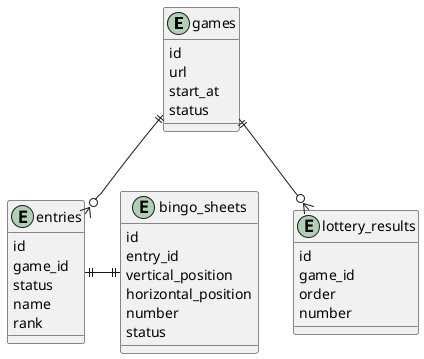

# 設計

## 画面

・ルーレット画面
└ 全体に大きなスクリーンで表示する画面
└数字のルーレット表示、決定済み数字表示、過去の数字表示、参加用QR表示
└リーチイベントの表示、ビンゴイベントの表示
・ビンゴシート画面
└ それぞれの参加者の画面
└リーチイベントの表示、ビンゴイベントの表示
・管理画面
└管理者用の画面
└参加者の一覧表示、決定済み数字表示

## アーキテクチャ

- データ永続化には、 firebase の firestore とか
- フロントは vue, vuetify 利用

## データモデル

## 制約

- IP制限はつけない
- ブラウザを閉じたら